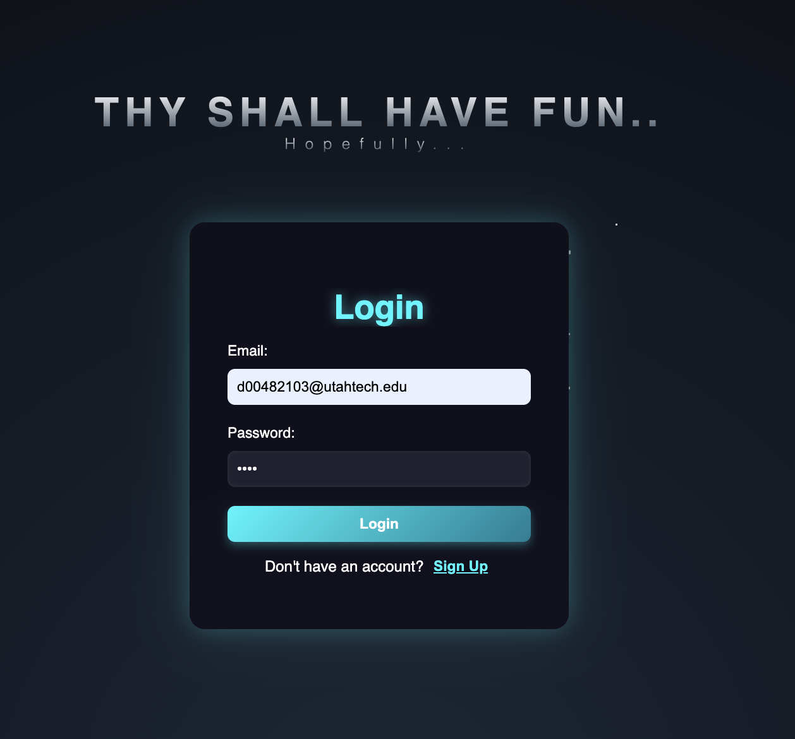
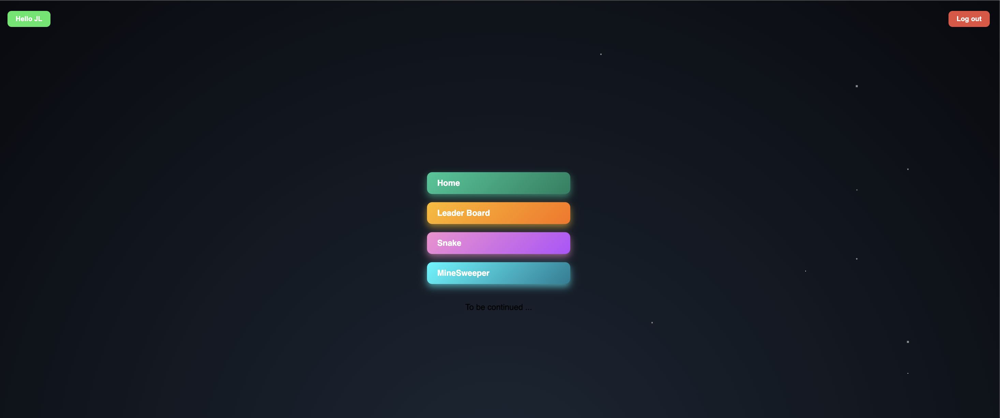
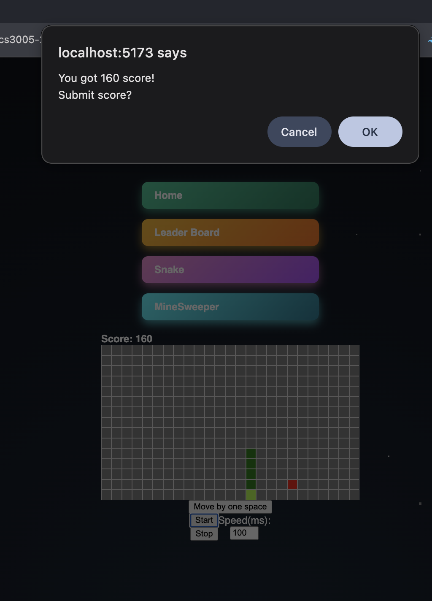
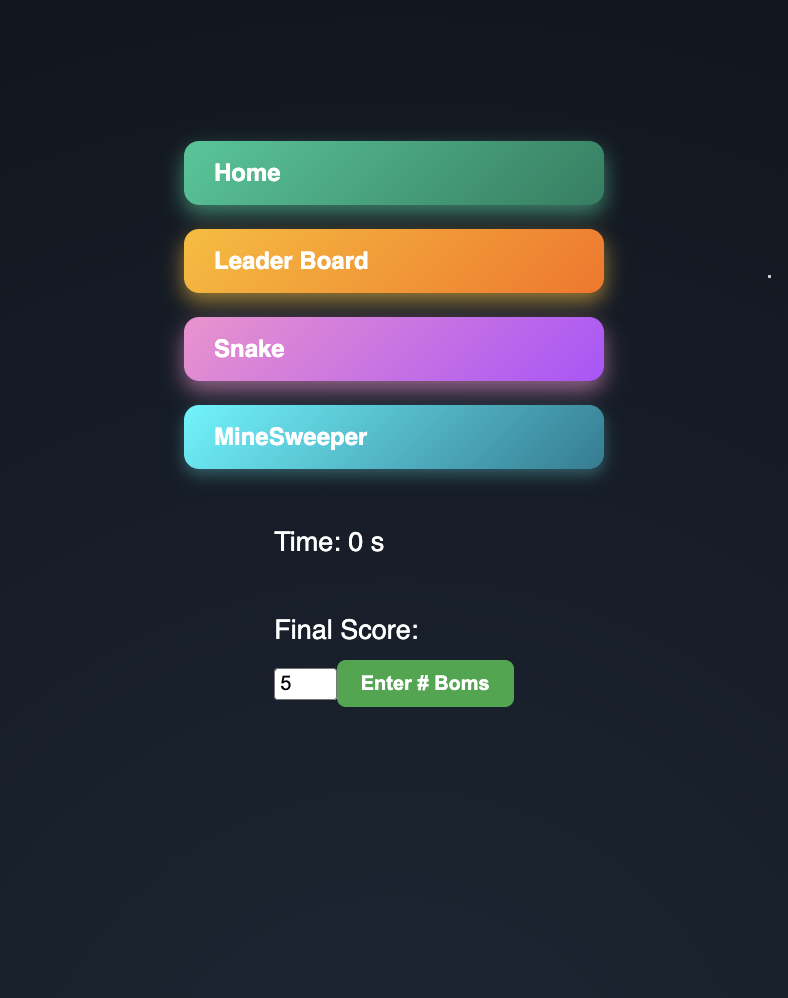
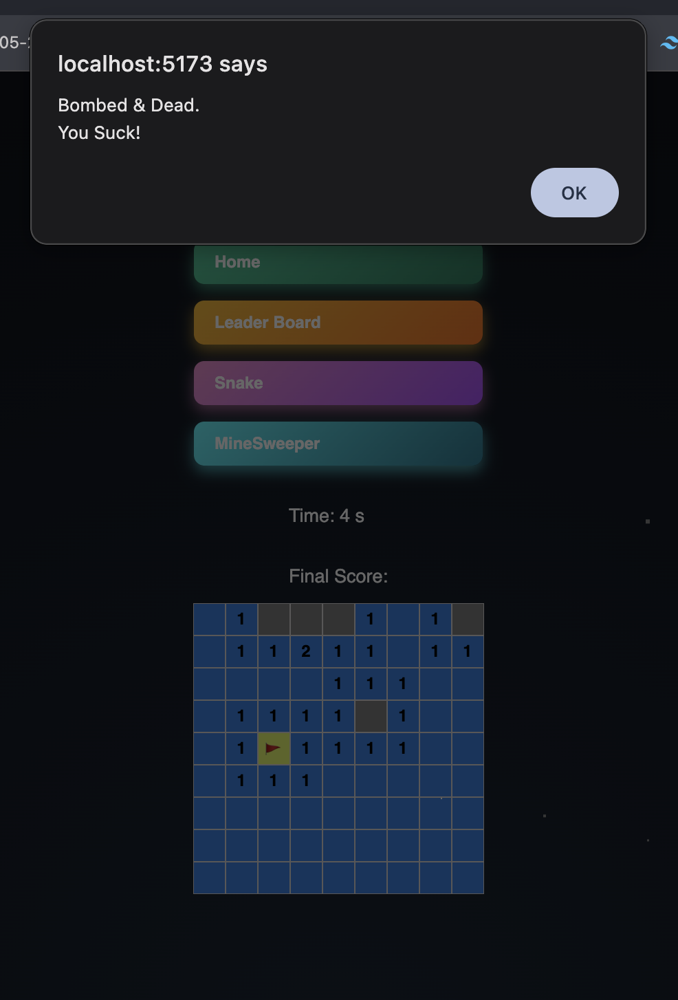
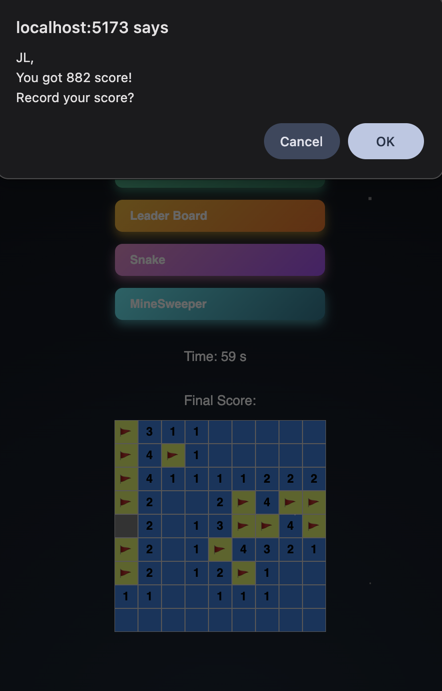
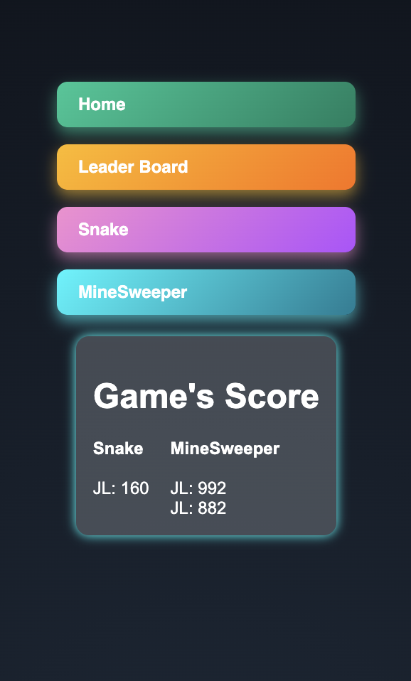

Schreenshot Overview:










---

# 🕹️ Arcade Platform

A full-stack web arcade featuring classic games like **Minesweeper** and **Snake**, complete with a persistent global leaderboard and user authentication.

## 🚀 Features

- **User Accounts:** Secure signup and login using Bcrypt encryption.
- **Global Leaderboard:** Compete for high scores stored in MongoDB.
- **Classic Games:** Fully playable Snake and Minesweeper built with Vue.js.
- **Responsive Design:** Playable on various screen sizes.

---

## 🛠️ Tech Stack

- **Frontend:** [Vue.js](https://vuejs.org/) + [Vite](https://vitejs.dev/)
- **Backend:** [Node.js](https://nodejs.org/) + [Express](https://expressjs.com/)
- **Database:** [MongoDB Atlas](https://www.mongodb.com/atlas)
- **Authentication:** JWT / Express-Session & Bcrypt

---

## 📦 Getting Started

### Prerequisites

- [Node.js](https://nodejs.org/) (v18 or higher recommended)
- A MongoDB Atlas account and cluster.

### 1. Backend Setup

1. Navigate to the backend directory:

```bash
cd backend

```

2. Install dependencies:

```bash
npm install

```

3. Create a `.env` file and add your MongoDB connection string:

```text
MONGO_URI=mongodb+srv://<username>:<password>@cluster0.xxxx.mongodb.net/arcade?retryWrites=true&w=majority
PORT=3000

```

4. Start the server:

```bash
node main-express.js

```

### 2. Frontend Setup

1. Open a new terminal tab and navigate to the frontend directory:

```bash
cd frontend

```

2. Install dependencies:

```bash
npm install

```

3. Start the development server:

```bash
npm run dev

```

4. Open your browser to the URL shown in the terminal (usually `http://localhost:5173`).

---

## 🖥️ Project Structure

```text
├── backend/
│   ├── main-express.js   # Main server entry point
│   ├── model.js          # MongoDB schemas (User, Score)
│   └── .env              # Environment variables (private)
├── frontend/
│   ├── src/              # Vue components and game logic
│   ├── public/           # Static assets
│   └── vite.config.js    # Vite configuration
└── README.md

```
